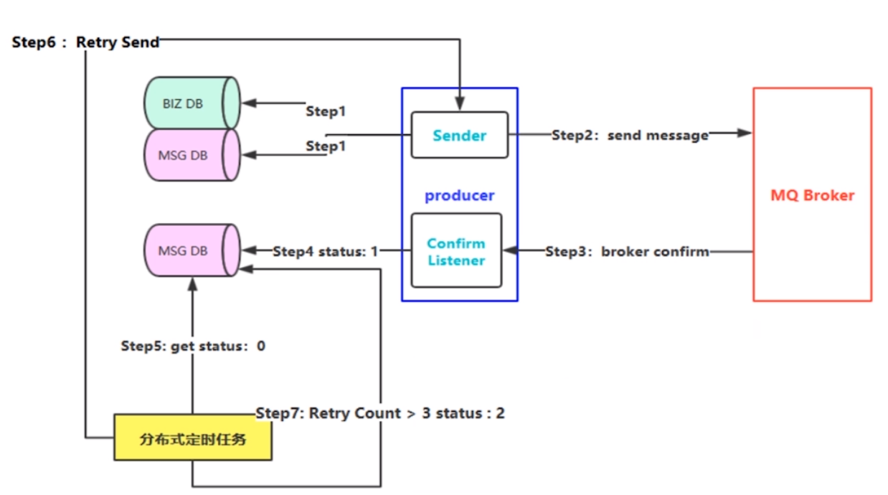

# RabbitMQ

## RabbitMQ 架构模型

## RabbitMQ 名词

1. Server（服务器）：又称 Broker，接收客户端的连接，实现 AMQP 实体服务
2. Channel（信道）：消息读写的信道，客户端可建立多个 channel，每个 channel 代表一个会话任务
3. Message（消息）：服务器和应用程序之间传送的数据，由 Properties 和 Body 组成，Properties 可以对消息进行修饰，如消息优先级、延迟等高级特性；Body 则指消息实体
4. Virtual Host（虚拟地址）：一般是用于隔离不同项目的路由，一个 Virtual Host 内可以有若干个 Exchange 和 Queue，但同一个 Virtual Host 中不能有相同名称的 Exchange 或 Queue
5. Exchange（交换器）：接收消息，根据路由键转发消息到绑定的队列
6. Binding（绑定）：Exchange 和 Queue 之间的虚拟连接，可包含 RoutingKey
7. RoutingKey（路由键）：一个路由规则，虚拟机可以用它来确定如何路由一个特定消息
8. Binding（绑定）：用于把交换器的消息绑定到队列上
9. Queue（队列）：用于存储生产者信息并转发个消费之

## RabbitMQ 四种交换机模式

1. Direct 模式
2. Topic 模式
3. Fanout 模式：广播模式，可发送消息到多个队列
4. Headers 模式：需满足 Headers 定义的 map 才能发送到队列

## routing key 中\*与#的区别

order.\* -> order.123

order.# -> order.123.456.789

## RabbitMQ 如何保证消息的可靠性

## 如何避免消息重复投递或重复消费

<comment-comment/>