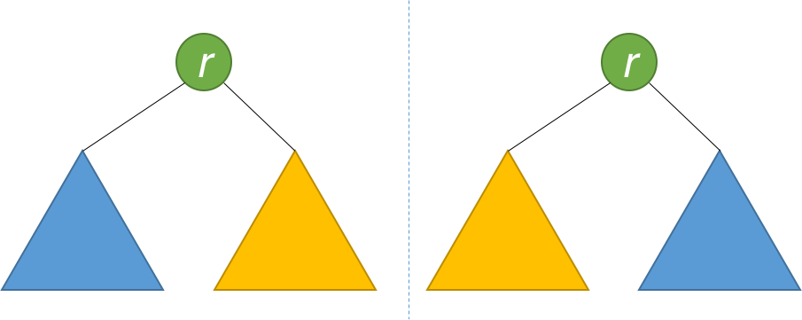

# 二叉树

::: tip 二叉树问题常规思路：

1. 递归
   :::

## 102 二叉树的层次遍历.

### 题目描述

给定一个二叉树，返回其按层次遍历的节点值。 （即逐层地，从左到右访问所有节点）。

例如:
给定二叉树: `[3,9,20,null,null,15,7]`,

```
    3
   / \
  9  20
    /  \
   15   7
```

返回其层次遍历结果：

```
[
  [3],
  [9,20],
  [15,7]
]
```

---

### 思考

最开始最陷入的坑是思考顺序问题，我的数值拿到了，到底是否是按照先后顺序存放，然后保险起见想到分别将每一层的结点用深度标记，最后深度（也就是层数）逐个遍历，放入最终的 list

---

### 递归实现

```java
    private Map<Integer,List<Integer>> map = new HashMap<>();
    private int maxDepth = 0;//记录最大深度

    public List<List<Integer>> levelOrder(TreeNode root) {
        List<List<Integer>> lists = new LinkedList<>();
        if(root == null) {
            return lists;
        }
        levelOrder(0,root);

        for(int i=0; i<=maxDepth; i++){//从第0层开始一层一层遍历，直到最大深度
            lists.add(map.get(i));
        }

        return lists;

    }

    private void levelOrder(int i, TreeNode root) {
        if(root != null){
            maxDepth = maxDepth>i?maxDepth:i;
            List<Integer> listI = new LinkedList<>();
            if(null!=map.get(i)){//如果map没有这个key（也就是没有这一层的数），就新增
                listI = map.get(i);
            }
            listI.add(root.val);
            map.put(i,listI);
            int nextLevel = ++i;
            levelOrder(nextLevel,root.left);
            levelOrder(nextLevel,root.right);
        }
    }
```

---

### 反思

担心 list 不能按照顺序返回没有必要，因为 list 就是按照顺序 add 的，同时也可以 get 某一个指定 index 的结点。所以不借助其他数据结构就可以实现。

---

### 优化

```java
public List<List<Integer>> levelOrder2(TreeNode root) {
        if (root == null) return new ArrayList<>();
        List<List<Integer>> result = new ArrayList<>();
        dfs(root, 0, result);
        return result;
    }

    public void dfs(TreeNode node, int level, List<List<Integer>> result) {
        if (node == null) return;
        if (result.size() < level + 1) result.add(new ArrayList<>());
        result.get(level).add(node.val);
        dfs(node.left, level + 1, result);
        dfs(node.right, level + 1, result);
    }
```

---

### 总结

1. 不要立刻想到用更高级的数据结构或其他容器，减少系统不必要的开销
2. 顺序问题不是 list 主要关注的点

---

## 101 对称二叉树.

### 题目描述

给定一个二叉树，检查它是否是镜像对称的。

例如，二叉树  [1,2,2,3,4,4,3] 是对称的。

```text
    1
   / \
  2   2
 / \ / \
3  4 4  3
```

但是下面这个  [1,2,2,null,3,null,3] 则不是镜像对称的:

```text
    1
   / \
  2   2
   \   \
   3    3
```

说明:

如果你可以运用递归和迭代两种方法解决这个问题，会很加分。

---

### 思考

第一种情况，树[1,2,2,3,4,4,3] ，如果用中序遍历这棵树，得到的结果为[3,2,4,1,4,2,3]。这时如果能保存这个结果，并且拿到两个指针分别从前往后遍历、从后往前遍历，都遍历数组的一半路程，两个指针得到的结果总是相等的，则说明为对称二叉树。

### 递归实现

```java
List list = new ArrayList<Integer>() ;
public boolean isSymmetric(TreeNode root) {

    isSymmetricRecursion(root);

    int times = list.size()/2;

    for(int i=0; i<times; i++){
        int headIndex = (int) list.get(i);
        int tailIndex = (int) list.get(list.size()-1-i);
        if(headIndex != tailIndex) return false;
    }
    return true;
}

private void isSymmetricRecursion(TreeNode root){
    if(root != null){
        isSymmetricRecursion(root.left);
        list.add(root.val);
        isSymmetricRecursion(root.right);
    }
}
```

### 反思

实际上，这种想法的实现是无法满足所有情况的，如[1,2,2,2,null,2]，该树的中序遍历为[2,2,1,2,2]，

```text
    1
   / \
  2   2
 /   /
2   2
```

虽然树不是对称的，但是树的中序遍历结果是对称的，导致我们判断为 true。所以这种办法是不可取的。

通过中序遍历的方法即使得到数组，也需要重新遍历数组才能得到结果，是否可以在递归这棵树的时候就做了判断，直接返回结果呢？答案是肯定的。这种方法的核心思想就是将一棵树看作为两棵树。

这两棵树的根节点值相同，并且每个树的右子树都与另一个树的左子树镜像对称。则两棵树属于镜像对称，故该二叉树是对称二叉树。

### 优化

```java
public boolean isSymmetric2(TreeNode root) {
    return isSymmetric2Recursion(root,root);
}

private boolean isSymmetric2Recursion(TreeNode rootLeft,TreeNode rootRight){
    if(rootLeft == null && rootRight == null) return true;
    //两值不同时为null
    if(rootLeft == null || rootRight == null) return false;

    return (rootLeft.val == rootRight.val)
            //若不符合条件则直接短路返回false
            && isSymmetric2Recursion(rootLeft.right, rootRight.left)
            && isSymmetric2Recursion(rootLeft.left, rootRight.right);
}
```

### 反思

题目中要求用递归和迭代两种方法实现，那么迭代法应该怎么实现呢？
乍一想，迭代方法确实不易实现。这时就需要用到更高级的数据结构，我们这里用到的是队列（基于栈也可以实现）。思想是每次从队列中一次性取出两个元素进行比较，如果值相等，就按照上文所说的镜像规则将它们的左右孩子和右左孩子分别入队。这样一次迭代就完成了。我们可以用代码实现它

### 迭代实现

```java
public boolean isSymmetric3(TreeNode root) {
    Queue<TreeNode> q = new LinkedList<>();
    q.add(root);
    q.add(root);
    while (!q.isEmpty()) {
        TreeNode t1 = q.poll();
        TreeNode t2 = q.poll();
        if (t1 == null && t2 == null) continue;
        if (t1 == null || t2 == null) return false;
        if (t1.val != t2.val) return false;
        q.add(t1.left);
        q.add(t2.right);
        q.add(t1.right);
        q.add(t2.left);
    }
    return true;
}
```

### 总结

1. 用数值作比较的方法是不可取的，存在巧合
2. &&可以短路程序，是一种很聪明的方式
3. 高级数据结构的实现还是基于最朴素的思想


<comment-comment/>