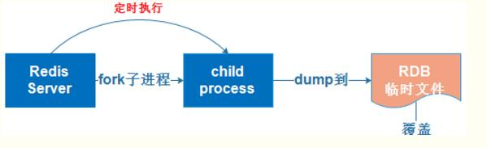

# 缓存

`非关系型数据库`

## Redis

### Redis 架构模型

#### 主从复制模型

1. 主从复制模型中，有多个 redis 节点。其中，有且仅有一个为主节点。从节点 Slave 可以有多个。Master 会一直将自己的数据更新同步给 Slaves，保持主从同步。
2. 主节点 Master 可读可写，从节点 Slave 只读
3. redis.conf 中配置 slaveof Master 的 ip 端口
4. 缺陷：Master 宕机了，整个集群就没有可写的节点了

#### 哨兵模式 Sentinel

Redis 的 Sentinel 系统用于管理多个 Redis 服务器（instance），执行以下认为

1. 监控（Monitoring）： Sentinel 会不断地检查你的主服务器和从服务器是否运作正常。
2. 提醒（Notification）： 当被监控的某个 Redis 服务器出现问题时， Sentinel 可以通过 API 向管理员或者其他应用程序发送通知。
3. 自动故障迁移（Automatic failover）：

- 当一个主服务器不能正常工作时， Sentinel 会开始一次自动故障迁移操作， 它会进行选举(Sentinel 个数为基数，选举采用多数原则)，将其中一个从服务器升级为新的主服务器， 并让失效主服务器的其他从服务器改为复制新的主服务器
- 当客户端试图连接失效的主服务器时， 集群也会向客户端返回新主服务器的地址， 使得集群可以使用新主服务器代替失效服务器。

4. sentinel.conf 中配置 sentinel moniter 主节点别名 主节点地址 端口 触发故障切换的最少哨兵数

### Redis 有哪几种数据类型及其使用

1.String

> - set key value
> - get key

2.Hash

> - hmset key field value
> - hset key field value
> - hget key field

3.List (FILO)

> - lpush key value[value...]
> - lrange key start stop

4.Set

> - sadd key member[member...]
> - smember key

5.Sorted set

> - zadd key score value
> - zrangebyscore key min max

### Redis 如何持久化

1.RDB 持久化：将 redis 在内存中的数据记录定时 dump 到磁盘上

方式：实际操作过程是 fork 一个子进程，先将数据集写入临时文件，写入成功后，再替换之前的文件，用二进制压缩存储

2.AOF 持久化：将 redis 的操作日志以追加的方式写入文件

方式：以日志的形式记录服务器所处理的每一个写、删除操作，查询操作都会以文本的方式记录，可以打开文件看到详细的操作记录

## Elasticsearch

---

# _参考_

[Redis 集群*主从复制*哨兵模型 -> \_\_\_mouM](https://www.cnblogs.com/aknife/archive/2019/07/15/11190911.html)

[Redis 持久化要不要来了解一下 -> 我只是一个小白木木](https://www.jianshu.com/p/472f3850a333)

<comment-comment/>