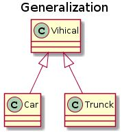
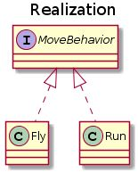
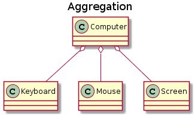
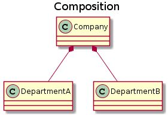
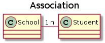
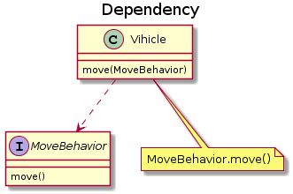
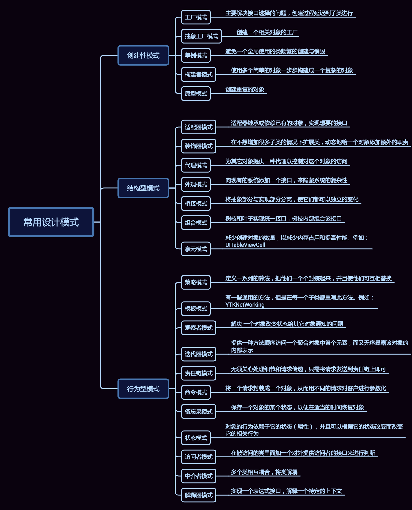

# 设计模式

## UML 类图

### 泛化关系 (Generalization)

- 用来描述继承关系，在 Java 中使用 extends 关键字 
  

### 实现关系 (Realization)

- 用来实现一个接口，在 Java 中使用 implements 关键字 
  

### 聚合关系 (Aggregation)

- 表示整体由部分组成，但是整体和部分不是强依赖的，整体不存在了部分还是会存在 
  

### 组合关系 (Composition)

- 和聚合不同，组合中整体和部分是强依赖的，整体不存在了部分也不存在了 
  

### 关联关系 (Association)

- 表示不同类对象之间有关联，这是一种静态关系，与运行过程的状态无关，在最开始就可以确定。因此也可以用 1 对 1、多对 1、多对多这种关联关系来表示 
  

### 依赖关系 (Dependency)

- 和关联关系不同的是，依赖关系是在运行过程中起作用的 
  ::: tip A 类和 B 类是依赖关系主要有三种形式：
  A 类是 B 类方法的局部变量；
  A 类是 B 类方法当中的一个参数；
  A 类向 B 类发送消息，从而影响 B 类发生变化。
  :::
  

---

## 设计模式预览

<comment-comment/>