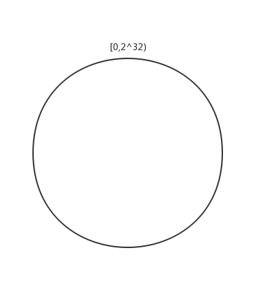
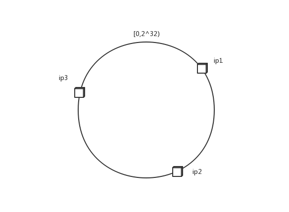
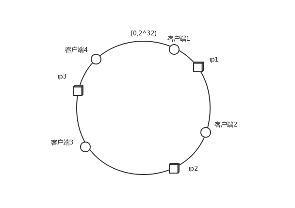
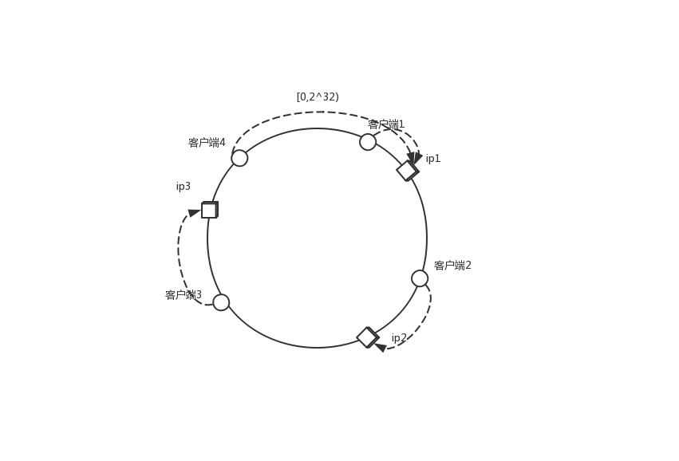
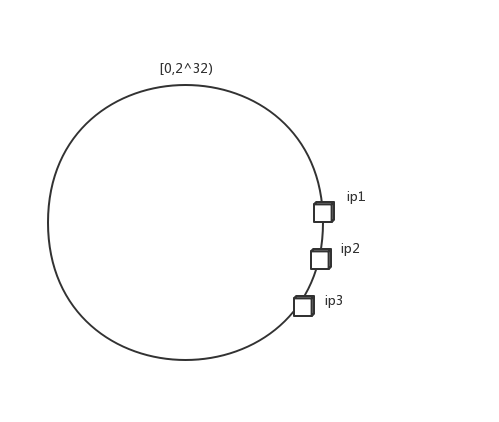
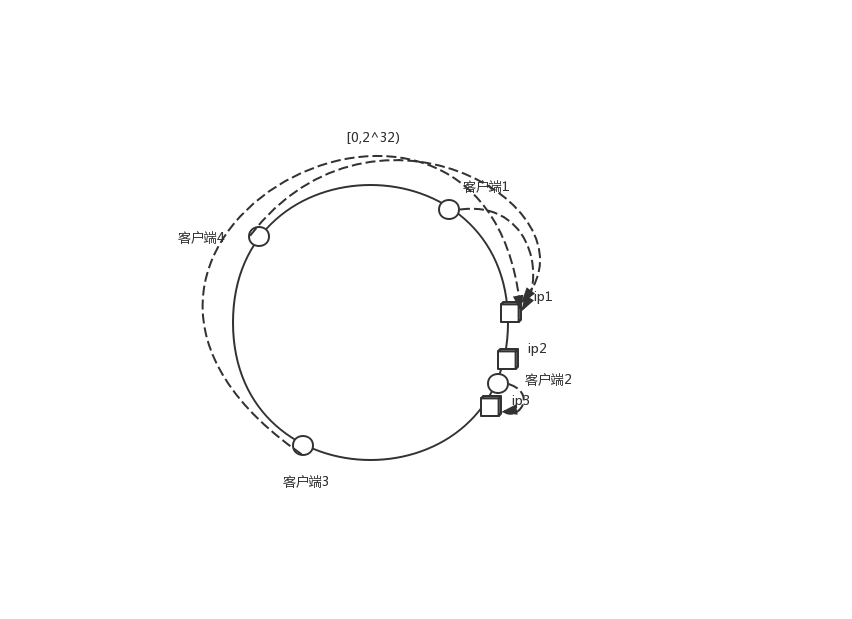
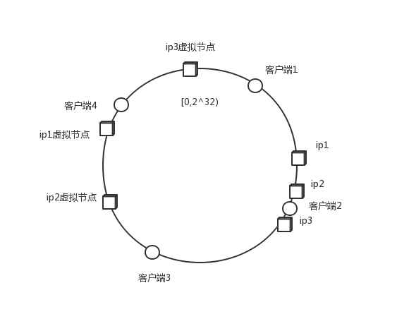
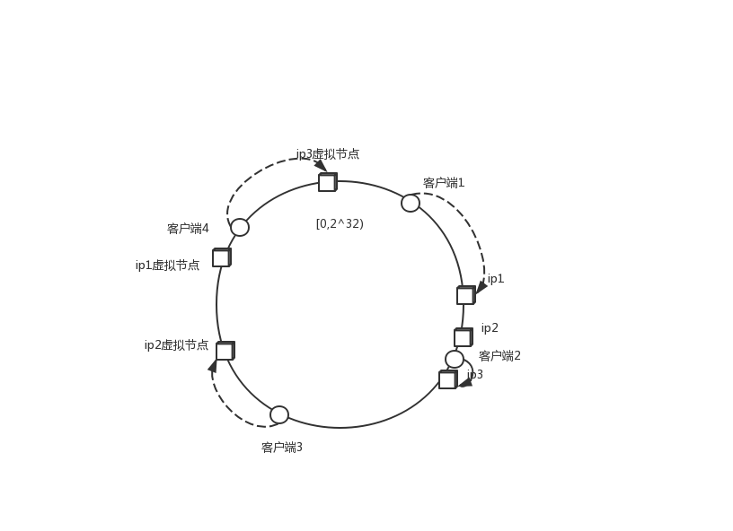

# 分布式

## 一致性哈希算法

### 由来

在解决分布式系统中负载均衡的问题是可以使用 hash 算法让固定的一部分请求落到同一台服务器上，这样每台服务器固定处理一部分请求（并维护这些请求的信息），起到负载均衡的作用。

### 原方式

我们通过`hash(用户id)%服务器机器数`公式可计算出请求应该落在哪个服务器上。但是这种算法伸缩性很差，当新增或者下线服务器机器时候，公式的除数发生变化，用户 id 与服务器的映射关系会大量失效，导致部分数据找不到对应服务器。我们不得不找寻优化方式

### 一致性哈希

一致性哈希不再是对服务器数量进行取模，而是对 2^32 取模，公式为`hash(IP)%2^32`

我们可以将[0,2^32)想象成为一个闭合的圆环，也称为 _Hash 环_

服务器使用自己的 ip 运用到一致性哈希算法中可以找到自己在环中对应的位置

同样的，当客户端请求过来，也可以通过自身的 ip 和一致性 hash 算法计算出自己在 hash 环上的位置

客户端会请求从客户端的位置开始，延顺时针方向遇到的第一个服务器

这里做一下说明，新增一台服务器或减少一台服务器（某一台服务器宕机），客户端都会按照规则寻址到顺时针最近的一天服务器上。

### 一致性哈希的特性

一致性 hash 保证三个特性

1. 单调性(Monotonicity) ：单调性是指如果已经有一些请求通过哈希分派到了相应的服务器进行处理，又有新的服务器加入到系统中时候，应保证原有的请求可以被映射到原有的或者新的服务器中去，而不会被映射到原来的其它服务器上去
2. 分散性(Spread)
3. 平衡性(Balance)

### 哈希倾斜

在实际的映射中，服务器的位置不见得如上图一样分散，有可能出现聚集的情况，这就是我们所说的 hash 倾斜

这样当客户端的调用来了，则请求可能大概率的落在 ip1 服务器上，导致负载不均衡

为了处理这样的问题，我引入一个新的名词，叫做**虚拟节点**

### 虚拟节点

我们解决 hash 倾斜的问题，一个最朴素的想法就是再添加多台服务器，但是添加服务器是有成本的。如没有多余的真正的物理服务器结点，我们可以将现有的物理节点通过虚拟的方法复制出来，这些由实际结点虚拟复制而来的结点就被称为**虚拟节点**

这样客户端在调用的时候会分散到不同主机的虚拟节点上，缓解了 ip1 服务器的压力

### 均匀一致性哈希

我们知道，即使添加了多个虚拟节点，负载也不能保证完全均衡。均匀一致性 hash 的目标是如果服务器有 N 台，客户端的 hash 值有 M 个，那么每个服务器应该处理大概 M/N 个用户的。也就是每台服务器负载尽量均衡

### 总结

在分布式系统中一致性 hash 起着不可忽略的地位，无论是分布式缓存，还是分布式 Rpc 框架的负载均衡策略都有所使用

---

# _参考_

[深入浅出一致性 Hash 原理 -> 阿里加多](https://www.jianshu.com/p/e968c081f563)

[白话解析：一致性哈希算法 -> 朱双印](http://www.zsythink.net/archives/1182/)

<comment-comment/>