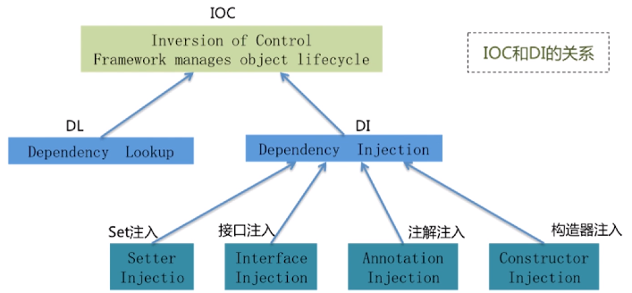
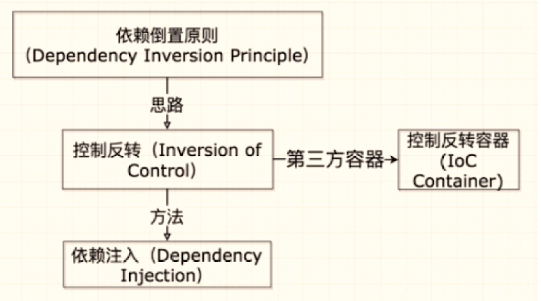
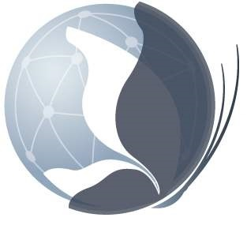
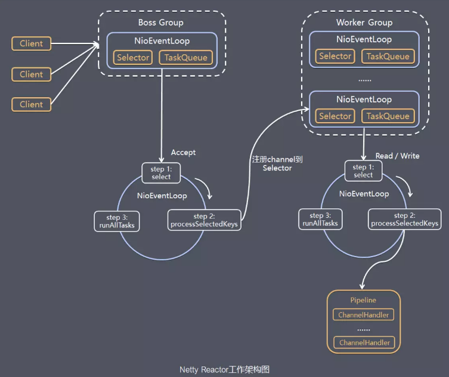
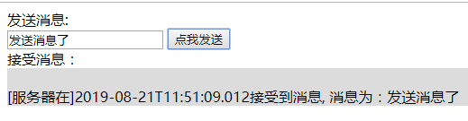
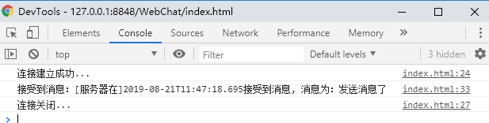
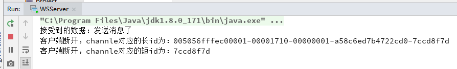

# 框架

## Spring


### IOC 原理

Inversion of Control -> 控制反转

- Spring Core 最核心的部分
- 需要先了解依赖注入 DI（Dependency Injection）

#### 依赖注入 DI

::: tip 小提示
DI 的关键在于上层模块决定下层模块，而不依赖于下层模块
:::


#### 依赖注入方式

- Setter
- Interface
- Constructor
- Annotation -> 如：@Autowired

#### 依赖倒置原则、IOC、DI、IOC 容器的关系



#### IOC 容器的优势

- 避免在各处使用 new 来创建类，摒弃可以做到统一维护
- 创建实例的时候不需要了解其中的细节

#### IOC 应用


### 处理 jsp 请求


`核心架构的具体流程步骤如下`

1. 首先用户发送请求 -> DispatcherServlet，前端控制器收到请求后自己不进行处理，而是委托给其他的解析器进行处理，作为统一访问点，进行全局的流程控制；
2. DispatcherServlet -> HandlerMapping， HandlerMapping 将会把请求映射为 HandlerExecutionChain 对象（包含一个 Handler 处理器（页面控制器）对象、多个 HandlerInterceptor 拦截器）对象，通过这种策略模式，很容易添加新的映射策略；
3. DispatcherServlet -> HandlerAdapter，HandlerAdapter 将会把处理器包装为适配器，从而支持多种类型的处理器，即适配器设计模式的应用，从而很容易支持很多类型的处理器；
4. HandlerAdapter -> 处理器功能处理方法的调用，HandlerAdapter 将会根据适配的结果调用真正的处理器的功能处理方法，完成功能处理；并返回一个 ModelAndView 对象（包含模型数据、逻辑视图名）；
5. ModelAndView 的逻辑视图名 -> ViewResolver， ViewResolver 将把逻辑视图名解析为具体的 View，通过这种策略模式，很容易更换其他视图技术；
6. View -> 渲染，View 会根据传进来的 Model 模型数据进行渲染，此处的 Model 实际是一个 Map 数据结构，因此很容易支持其他视图技术；
7. 返回控制权给 DispatcherServlet，由 DispatcherServlet 返回响应给用户，到此一个流程结束。

---

## Dubbo


### dubbo 架构模型


#### 调用关系说明

0. 服务容器负责启动，加载，运行服务提供者。
1. 服务提供者在启动时，向注册中心注册自己提供的服务。
1. 服务消费者在启动时，向注册中心订阅自己所需的服务。
1. 注册中心返回服务提供者**地址列表**给消费者，如果有变更，注册中心将基于长连接推送变更数据给消费者。
1. 服务消费者，从提供者地址列表中，基于软负载均衡算法，选一台提供者进行调用，如果调用失败，再选另一台调用。
1. 服务消费者和提供者，在内存中累计调用次数和调用时间，定时每分钟发送一次统计数据到监控中心。

---

## Netty



### Netty 架构模型



### Netty 生命周期

### Netty 实现 websocket 例子

#### 添加 netty 依赖

```xml
<dependency>
	<groupId>io.netty</groupId>
	<artifactId>netty-all</artifactId>
	<version>4.1.25.Final</version>
</dependency>
```

---

我们在介绍 netty 相关知识的时候已经了解到，netty 目前是采用的主从线程组实现的。那么我们也模拟这种方式实现一个 websocket 服务器。

实现 netty 大致分为三个步骤：

1. 实现主从线程组并绑定端口
2. 实现 channel 的初始化器
3. 设置（自定义的）handler

#### 实现主从线程组并绑定端口

```java
// 定义一对线程组
// 主线程组： 用于接受客户端的连接，但不做任何处理
EventLoopGroup mainGroup = new NioEventLoopGroup();
// 从线程组：接受主线程组的任务，让手下线程组实际执行
EventLoopGroup subGroup = new NioEventLoopGroup();

try {
	// netty服务器的创建, ServerBootstrap 是一个启动类
	ServerBootstrap server = new ServerBootstrap();
	server.group(mainGroup, subGroup)		    // 设置主从线程组
		.channel(NioServerSocketChannel.class)  // 设置nio的双向通道
		.childHandler(new WSServerInitialzer());// 指定channel的初始化器

	// 启动server，并且设置8088为启动的端口号，同时启动方式为同步
	ChannelFuture future = server.bind(8088).sync();
	// 监听关闭的channel，设置位同步方式
	future.channel().closeFuture().sync();
} finally {
	//优雅关闭
	mainGroup.shutdownGracefully();
	subGroup.shutdownGracefully();
}
```

我们看到在第 12 行，new 了一个名为“WSServerInitialzer”的 channel 初始化器，接下来我们来实现它

---

#### 实现 channel 的初始化器

之前我们提到，一个 channel 对应这一个管道（pipeline），一个管道对应着多个 handler。在这一步呢，我们的操作就是进到 channel 里边，拿到对应的管道，绑定相应的 handler

```java
//首先继承ChannelInitializer，并实现其抽象方法
public class WSServerInitialzer extends ChannelInitializer<SocketChannel> {

	@Override
	protected void initChannel(SocketChannel ch) throws Exception {
		// 通过SocketChannel去获得对应的管道
		ChannelPipeline pipeline = ch.pipeline();

		// websocket 基于http协议，所以要有http编解码器
		pipeline.addLast(new HttpServerCodec());
		// 对写大数据流的支持
		pipeline.addLast(new ChunkedWriteHandler());
		// 对httpMessage进行聚合，聚合成FullHttpRequest或FullHttpResponse
		// 几乎在netty中的编程，都会使用到此hanler
		pipeline.addLast(new HttpObjectAggregator(1024*64));

		// ====================== 以上是用于支持http协议    ======================

		// ====================== 以下是支持httpWebsocket ======================

		/**
		 * websocket 服务器处理的协议，用于指定给客户端连接访问的路由 : /ws
		 * 本handler会帮你处理一些繁重的复杂的事
		 * 会帮你处理握手动作： handshaking（close, ping, pong） ping + pong = 心跳
		 * 对于websocket来讲，都是以frames进行传输的，不同的数据类型对应的frames也不同
		 */
		pipeline.addLast(new WebSocketServerProtocolHandler("/ws"));

		// 自定义的handler
		pipeline.addLast(new ChatHandler());
	}
}
```

在第 30 行指定了自定义的 handler，下面来实现它

---

#### 设置（自定义的）handler

```java
/**
 *
 * @Description: 处理消息的handler
 * TextWebSocketFrame： 在netty中，是用于为websocket专门处理文本的对象，frame是消息的载体
 */
public class ChatHandler extends SimpleChannelInboundHandler<TextWebSocketFrame> {

	// 用于记录和管理所有客户端的channle
	private static ChannelGroup clients =
			new DefaultChannelGroup(GlobalEventExecutor.INSTANCE);

	@Override
	protected void channelRead0(ChannelHandlerContext ctx, TextWebSocketFrame msg)
			throws Exception {
		// 获取客户端传输过来的消息
		String content = msg.text();
		System.out.println("接受到的数据：" + content);

//		for (Channel channel: clients) {
//			channel.writeAndFlush(
//				new TextWebSocketFrame(
//						"[服务器在]" + LocalDateTime.now()
//						+ "接受到消息, 消息为：" + content));
//		}
		// 下面这个方法，和上面的for循环，一致
		clients.writeAndFlush(
				new TextWebSocketFrame(
						"[服务器在]" + LocalDateTime.now()
						+ "接受到消息, 消息为：" + content));

	}

	/**
	 * 当客户端连接服务端之后（打开连接）
	 * 获取客户端的channle，并且放到ChannelGroup中去进行管理
	 */
	@Override
	public void handlerAdded(ChannelHandlerContext ctx) throws Exception {
		clients.add(ctx.channel());
	}

	@Override
	public void handlerRemoved(ChannelHandlerContext ctx) throws Exception {
		// 当触发handlerRemoved，ChannelGroup会自动移除对应客户端的channel
		// clients.remove(ctx.channel());
		System.out.println("客户端断开，channle对应的长id为："
							+ ctx.channel().id().asLongText());
		System.out.println("客户端断开，channle对应的短id为："
							+ ctx.channel().id().asShortText());
	}

}
```

到这里，一个基于 netty 实现的简单版本 websocket 就大致完成了，我们可以编写一个客户端测试一下

---

#### 客户端测试

在前端简单写一下测试页面，指向我本机的 ip 以及规定的路由。定义一个 chat 对象，同时我们监听一下页面的连接周期

```html
<body>
  <div>发送消息:</div>
  <input type="text" id="msgContent" />
  <input type="button" value="点我发送" onclick="CHAT.chat()" />

  <div>接受消息：</div>
  <div id="receiveMsg" style="background-color: gainsboro;"></div>

  <script type="application/javascript">
    window.CHAT = {
      socket: null,
      init: function() {
        if (window.WebSocket) {
          CHAT.socket = new WebSocket('ws://192.168.184.12:8088/ws')
          ;(CHAT.socket.onopen = function() {
            console.log('连接建立成功...')
          }),
            (CHAT.socket.onclose = function() {
              console.log('连接关闭...')
            }),
            (CHAT.socket.onerror = function() {
              console.log('发生错误...')
            }),
            (CHAT.socket.onmessage = function(e) {
              console.log('接受到消息：' + e.data)
              var receiveMsg = document.getElementById('receiveMsg')
              var html = receiveMsg.innerHTML
              receiveMsg.innerHTML = html + '<br/>' + e.data
            })
        } else {
          alert('浏览器不支持websocket协议...')
        }
      },
      chat: function() {
        var msg = document.getElementById('msgContent')
        CHAT.socket.send(msg.value)
      }
    }

    CHAT.init()
  </script>
</body>
```

展示结果：

1.客户端页面



2.客户端 F12



3.服务端控制台



---

# _参考_

[剑指 Java 面试 -> 慕课/翔仔](https://coding.imooc.com/class/303.html)<br>
[一文理解 Netty 模型架构 -> 贝聊科技](https://juejin.im/post/5bda4cc55188257f630dac07)


<comment-comment/>