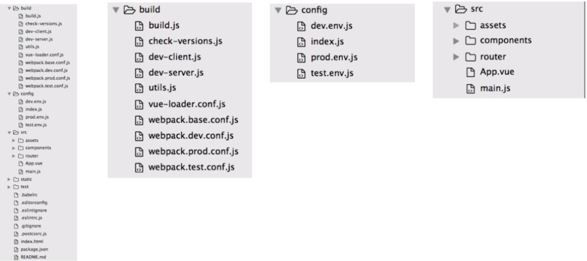
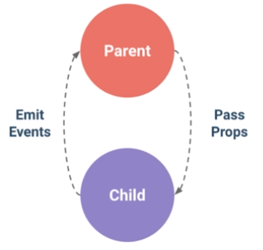

# 前端

## Vue


### Vue 配置介绍

`项目结构`


#### build

- 打包的配置文件所在的文件夹

#### config

- 打包的配置

#### src

- 源码<br>
  1.App.vue -> 入口组件<br>
  2.main.js -> 入口文件<br>

#### static

- 静态文件

#### .babelrc

- ES6 解析的配置

#### .editorconfig

- 编辑器的设置

#### .gitignore

- 忽略 git 提交

#### postcssrc.js

- HTML 添加前缀的配置

#### index.html

- 单页面的入口 -> 通过 webpack 打包，编译源码，最终插入到这个 html 页面里来，来进行访问

#### package.json<br>

1.项目描述，版本号等信息<br>
2.script -> 脚本命令<br>
3.dependcies -> 依赖库<br>
4.devdependcies -> 测试依赖库，辅助开发项目，打包过程中是需要的，打完包即不需要了<br>

### 基础语法

#### 模版语法

- Mustache 语法：{{ msg }}
- HTML 赋值：v-html=""
- 绑定属性：v-bind:id=""
- 使用表达式：{{ ok?'YES':'NO'}}
- 文本赋值：v-text=""
- 指令：v-if=""
- 过滤器：{{message | capitalize}} 和 v-bind:id="rawId | formatId"

#### Class 和 Style 绑定

- 对象语法：v-bind:class="{active:isActive,'text-danger':hasError}"
- 数组语法：

```html
1.
<dir v-bind:class="[activeClass,errorClass]">
  2. data: { activeClass: 'active', errorClass: 'text-danger' }
</dir>
```

- style 绑定-对象语法： v-bind:style="{ color:activeColor, fontSize:fontSize + 'px' }"

#### 条件渲染

- v-if
- v-else
- v-else-if
- v-show

::: tip v-show 与 v-if 的区别
v-show 对应的 div 已经渲染好了，通过 css 来控制显示和隐藏。<br>
v-if 如果是 false，那么整个 DOM 就不会被渲染
:::

- v-cloak：界面刷新太快导致页面某些元素没有加载出来，v-cloak 可以同步去隐藏 HTML 代码

#### Vue 事件处理器

- v-on:click="greet" 或者 @click="greet"
  ::: tip 事件修饰符
  v-on:click.stop -> 阻止冒泡<br>
  v-on:click.stop.prevent -> 阻止默认事件<br>
  v-on:click.self -> 给绑定事件的对象本身绑定事件<br>
  v-on:click.once -> 只给这个事件绑定生效一次<br>
  :::
- v-on:keyup.enter -> 捕捉键盘事件

::: tip 事件修饰符
v-on:keyup.enter<br>
v-on:keyup.tab<br>
v-on:keyup.delete<br>
v-on:keyup.esc<br>
v-on:keyup.space<br>
v-on:keyup.up<br>
v-on:keyup.down<br>
v-on:keyup.left<br>
v-on:keyup.right<br>
:::

#### Vue 组件

- 全局组件和局部组件
- 父子组件通讯 ->　数据传递
  

`Vue中不允许数据从子组件流向父组件，但是可以通过Emit的方式变相的传递数据`

> 子组件 -> this.\$emit(父组件自定义事件名称) <br>
> 通过 Emit 来触发父组件的方法

- Slot 插槽

---

# _参考_

[Get 全栈技能点 Vue2.0/Node.js/MongoDB 打造商城系统 -> 慕课/河畔一角](https://coding.imooc.com/learn/list/113.html)


<comment-comment/>