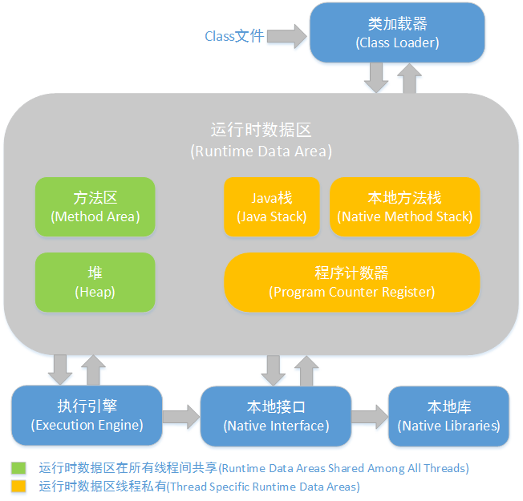
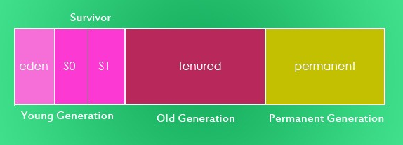

# Java

## Java 基础

### HashMap

#### 1. hashMap 的基本参数设置

::: tip 回答

1. 默认初始化容量是 16
2. 默认负载因子是 0.75
3. 容量的临界值为 12
4. 链表长度超过临界值 8 则进行红黑树化
5. 扩容为原来容量的 2 倍
   :::

##### 分析

```java
static final int DEFAULT_INITIAL_CAPACITY = 1 << 4; // aka 16

static final int MAXIMUM_CAPACITY = 1 << 30;

static final float DEFAULT_LOAD_FACTOR = 0.75f;

static final int TREEIFY_THRESHOLD = 8;

static final int UNTREEIFY_THRESHOLD = 6;

static final int MIN_TREEIFY_CAPACITY = 64;
```

---

#### 2. hashMap 的初始容量为什么是 2^n.

::: tip 回答

1. 源码：p = tab[i = (n - 1) & hash] 可简记为`(n - 1) & hash`
2. &运算提高了计算效率
3. n-1 保证为奇数，做&操作结果有奇有偶，提升了散列度
   :::

##### 分析

1.a % b == a & (b - 1)

2.这里涉及到位运算，不清楚的给一个[传送门](bitOperation.md)

(n - 1) & hash ，n 是容量规定为 2^n，那么 n-1 就是 2^n-1，其结果一定为奇数。

我们拿初始的容量举例子：

|    容量    |     |           |
| :--------: | :-: | :-------: |
|  capacity  | 16  | 0001 0000 |
| capacity-1 | 15  | 0000 1111 |

capacity-1，也就是 15 的二进制数末位是 1，它与其他数做&运算保证了结果的末位有 1 有 0，从而增加了散列度。

我们试想，如果&上的是 16(或者其他偶数)，结果末位只有一种可能性，就是为 0，加大了 hash 冲突的概率

---

#### 3. hashMap 如何降低 hash 碰撞

::: tip 回答

1. 容量总为 2^n
2. 取 hash 值时使用了异或提高散列度
   :::

##### 分析

```java
static final int hash(Object key) {
    int h;
    return (key == null) ? 0 : (h = key.hashCode()) ^ (h >>> 16);
}
```

这里给出结论，不做过多数学分析，小伙伴们有兴趣的可以根据位运算规则拿纸笔实际演算一下。

两个二进制相似的数，他们本身数值和（容量-1）做与运算的结果有可能相同，但是通过上述公式先做异或，再做与运算的结果就很难相同了

---

#### 4. hashMap 如何处理 hash 碰撞

::: tip 回答

1. 拉链法
2. 链表长度超过临界值 8 则进行红黑树化
   :::

```java
for (int binCount = 0; ; ++binCount) {
    if ((e = p.next) == null) {
        //直到链表的最后一个节点（next==null）,将next赋给新的节点
        p.next = newNode(hash, key, value, null);
        //如果链表长度超过临界值，则进行树化
        if (binCount >= TREEIFY_THRESHOLD - 1) // -1 for 1st
            treeifyBin(tab, hash);
        break;
    }
    if (e.hash == hash &&
            ((k = e.key) == key || (key != null && key.equals(k))))
        break;
    p = e;
}
```

---

#### 5. resize()后的内存分布

---

#### 源码

---

### HashTable

### ConcurrentHashMap

---

## J.U.C.

---

## I/O 模型

### BIO

### NIO

### AIO

---

## JVM

### JVM 架构模型


### JVM 内存模型



1. 程序计数器 -> 作用是标示下一条需要执行的指令的位置
2. Java 虚拟机栈 -> 描述的是 Java 方法执行的内存模型：每一个方法调用直至执行完的过程，就对应着一个栈帧在虚拟机栈中入栈到出栈的过程。
3. 本地方法栈 -> 与虚拟机栈类似，不过本地方法是为 native 方法服务的。
4. Java 堆 -> 线程共享区域，存放对象实例，所有的对象实例以及数据都要在堆上分配。**Java 堆是垃圾收集器管理的主要区域**
5. 方法区 -> 线程共享区域，它用于存储已被虚拟机加载的类信息、常量、静态变量、即时编译器编译后的代码等数据。

### Java 堆内存模型



1. 新生代（Young Generation）
   > Eden 空间 ->（Eden space，任何实例都通过 Eden 空间进入运行时内存区域）<br>
   > S0 Survivor 空间 ->（S0 Survivor space，存在时间长的实例将会从 Eden 空间移动到 S0 Survivor 空间）<br>
   > S1 Survivor 空间 -> （存在时间更长的实例将会从 S0 Survivor 空间移动到 S1 Survivor 空间）
2. 老年代（Old Generation）实例将从 S1 提升到 Tenured（终身代）
3. 永久代（Permanent Generation）包含类、方法等细节的元信息

### 类加载器

`双亲委派模型`<br>


1. User ClassLoader -> 自定义类加载器
2. AppClassLoader -> 应用类加载器
3. ExtClassLoader -> 扩展类加载器
4. Bootstrap ClassLoader -> 启动类加载器

## Java 版本特性

### 1.8

#### 一. 函数式接口

- 也称为功能性接口，是有且仅有一个抽象方法，但是可以有多个非抽象方法的接口
- java 8 提供 @FunctionalInterface 注解来标识函数式接口
- Lamda 表达式需要一个函数式接口来盛接

```java
// 函数式接口的例子

@FunctionalInterface //添加此注解后，接口中只能有一个抽象方法。
public interface A {
	void call();

}
```

#### 二. Lamda 表达式

- 语法

```java
(parameters) -> expression

或

(parameters) ->{statements; }
```

**举几个例子**

```java
// 不需要参数,返回值为 5
() -> 5

// 接收一个参数(数字类型),返回其2倍的值
x -> 2 * x

// 接受2个参数(数字),并返回他们的差值
(x, y) -> x – y

// 接收2个int型整数,返回他们的和
(int x, int y) -> x + y

// 接受一个 string 对象,并在控制台打印,不返回任何值(看起来像是返回void)
(String s) -> System.out.print(s)

```

```java

/*
 Runnable就是一个函数式接口：他只有一个方法run()方法。
 1、因为run()方法没有参数，所以   ->前面的()中不需要声明形参
 2、run返回的是void，所以不需要return。
 3、->后面写的代码其实就是定义在run方法内的代码。因为此处代码只有一行，所以{}也可以省略。如果此处多与一行，则无法省略。
 */
Runnable runnable = () -> System.out.println("这个是用拉姆Lambda的线程");
new Thread(runnable).start();

// 等价于

Runnable runnable = new Runnable() {

    @Override
    public void run() {
        System.out.println("这个是用内部类实现的线程");

    }
};
new Thread(runnable).start();

```

**注：**<br>

1. lambda 表达式的局部变量隐性的具有 final 语义，不可被后面的代码修改
2. Lambda 表达式当中不允许声明一个与局部变量同名的参数或者局部变量

#### 三. 方法引用

- 语法

```java
// 静态方法 -> ClassName::methodName
Object ::equals

// 实例方法 -> Instance::methodName
Object obj=new Object();
obj::equals;

// 构造函数
ClassName::new
```

#### 四. 默认方法

- 语法

```java
// 接口可以有实现方法，而且不需要实现类去实现其方法。需在方法名前面加default关键字

@FunctionalInterface
public interface A {

    void call();

    default void fun() {
        System.out.println("我是接口的默认方法1中的代码");
    }

    default void fun2() {
        System.out.println("我是接口的默认方法2中的代码");
    }
}
```

#### 五. Stream 流

- 概念

1. Stream 是对集合的包装,通常和 lambda 一起使用
2. 流作用是提供了一种操作大数据接口，让数据操作更容易和更快
3. 支持 map, filter, limit, sorted, count, min, max, sum, collect 等操作
4. Stream 使用懒运算
   > 中间方法和终端方法:<br>
   > 中间方法永远返回的是 Stream（Pipelining），终点操作才能收集流产生的最终结果<br><br>
   > 懒运算只有碰到终端方法才会执行

**举个栗子：**

```java
List<User> users = new ArrayList<User>();
users.add(new User(20, "张三"));
users.add(new User(22, "李四"));
users.add(new User(10, "王五"));

Stream<User> stream = users.stream();
//返回流中元素的个数。
long count = stream.filter((User user) ->  user.getAge() >= 20).map((User user) -> {return "50";}).count();
System.out.println(count);
```

其他方法 API 参考，[传送门](https://blog.csdn.net/javazyw/article/details/82733459)

#### 六. Optional 类

- 特性<br>
  Optional 类是一个可以为 null 的容器对象

**举个栗子：**

```java
public static void main(String args[]) {
    Java8Tester java8Tester = new Java8Tester();
    Integer value1 = null;
    Integer value2 = new Integer(10);
    // Optional.ofNullable - 允许传递为 null 参数
    Optional<Integer> a = Optional.ofNullable(value1);
    // Optional.of - 如果传递的参数是 null，抛出异常 NullPointerException
    Optional<Integer> b = Optional.of(value2);
    System.out.println(java8Tester.sum(a, b));
}

public Integer sum(Optional<Integer> a, Optional<Integer> b) {
    // Optional.isPresent - 判断值是否存在
    System.out.println("第一个参数值存在: " + a.isPresent());
    System.out.println("第二个参数值存在: " + b.isPresent());
    // Optional.orElse - 如果值存在，返回它，否则返回默认值
    Integer value1 = a.orElse(new Integer(0));
    //Optional.get - 获取值，值需要存在
    Integer value2 = b.get();
    return value1 + value2;
}
```

```txt
输出结果为：

第一个参数值存在:false
第二个参数值存在:true
10
```

#### 七. 日期时间 API

- 举个栗子：

```java
public static void main(String args[]) {
    Java8Tester java8tester = new Java8Tester();
    java8tester.testLocalDateTime();
}

public void testLocalDateTime() {
    // 获取当前的日期时间
    LocalDateTime currentTime = LocalDateTime.now();
    System.out.println("当前时间: " + currentTime);
    LocalDate date1 = currentTime.toLocalDate();
    System.out.println("date1: " + date1);
    Month month = currentTime.getMonth();
    int day = currentTime.getDayOfMonth();
    int seconds = currentTime.getSecond();
    System.out.println("月: " + month + ", 日: " + day + ", 秒: " + seconds);
    LocalDateTime date2 = currentTime.withDayOfMonth(10).withYear(2012);
    System.out.println("date2: " + date2);
    // 12 december 2014
    LocalDate date3 = LocalDate.of(2014, Month.DECEMBER, 12);
    System.out.println("date3: " + date3);
    // 22 小时 15 分钟
    LocalTime date4 = LocalTime.of(22, 15);
    System.out.println("date4: " + date4);
    // 解析字符串
    LocalTime date5 = LocalTime.parse("20:15:30");
    System.out.println("date5: " + date5);
}
```

```txt
输出结果为：

当前时间: 2018-06-08T15:19:16.910
date1:2018-06-08
月: JUNE, 日: 8, 秒: 16
date2:2012-06-10T15:19:16.910
date3:2014-12-12
date4:22:15
date5:20:15:30
```

#### 八. 其他特性

- Nashorn JavaScript<br>
  Nashorn 一个 javascript 引擎。
- Base64<br>
  Java8 中，Base64 编码已经成为 Java 类库的标准。

---

# _参考_

[JDK1.8，Java8 常用新特性 -> javazyw](https://blog.csdn.net/javazyw/article/details/82733459)<br>
[java8 新特性（拉姆达表达式 lambda） -> Rairmmd](https://blog.csdn.net/qq_35805528/article/details/53264301)<br>
[Java 中 Lambda 表达式的使用 -> Franson](https://blog.csdn.net/qq_35805528/article/details/53264301)<br>
[java1.8 新特性整理（全） -> 后知、后觉](https://www.cnblogs.com/xuxinstyle/p/11447820.html)<br>


<comment-comment/>