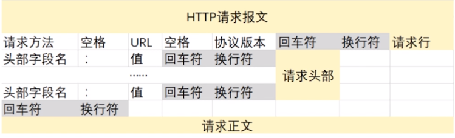
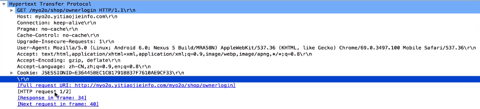
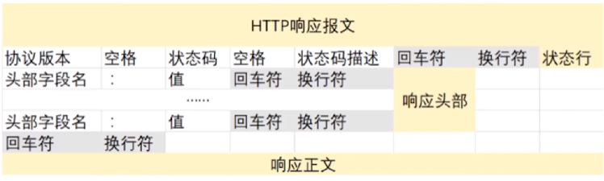
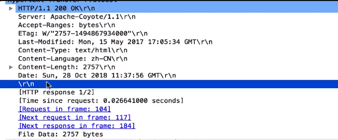
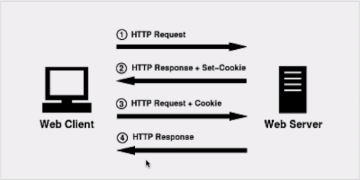
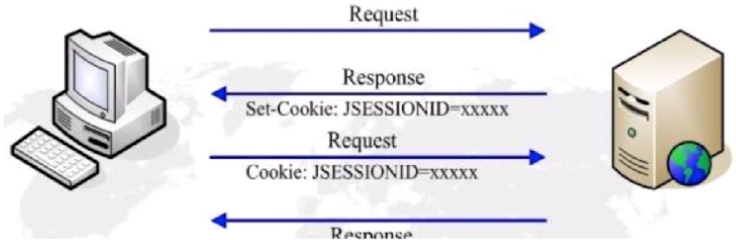
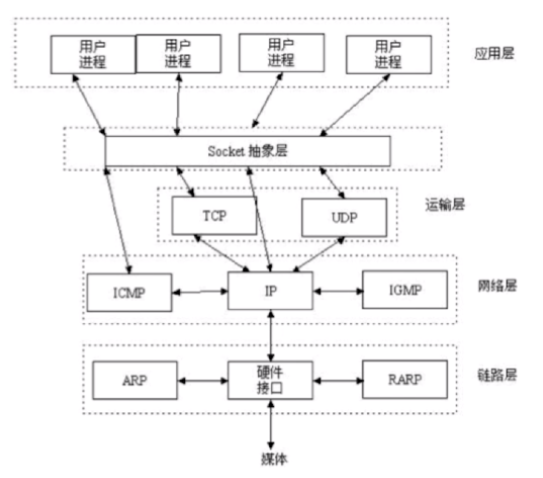
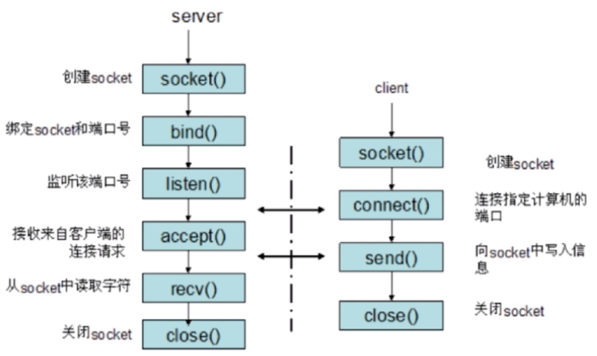

# 网络

`网络知识点`

## 网络 4/7 层模型各层作用和协议对比.

### 1.应用层

#### 应用层

- 作用

1. 应用层为操作系统或网络应用程序提供访问网络服务的接口

::: tip 协议
Telnet（Internet 远程登录服务的标准协议和主要方式）

FTP（文件传输协议）

HTTP（超文本传送协议）

SNMP（简单网络管理协议）
:::

#### 表示层

- 作用

1. 表示层对上层数据或信息进行变换以保证一个主机应用层信息可以被另一个主机的应用程序理解
2. 表示层的数据转换包括数据的加密、压缩、格式转换等

### 2.传输层

#### 会话层

- 作用

1. 会话层管理主机之间的会话进程，即负责建立、管理、终止进程之间的会话
2. 会话层还利用在数据中插入校验点来实现数据的同步

#### 传输层

- 作用

1. 传输层是第一个端到端，即主机到主机的层次
2. 传输层负责将上层数据分段并提供端到端的、可靠的或不可靠的传输
3. 传输层还要处理端到端的差错控制和流量控制问题
4. 数据的单位称为数据段（segment）

::: tip 协议
TCP（传输控制协议）

UDP（用户数据报协议）

SPX（序列分组交换协议）
:::

### 3.网间层

#### 网络层

- 作用

1. 网络层负责对子网间的数据包进行路由选择
2. 还可以实现拥塞控制、网际互连等功能
3. 数据的单位称为数据包（packet）

::: tip 协议
IP（网络之间互联的协议）

IPX（互联网数据包交换协议）

RIP（路由信息协议）

OSPF（开放式最短路径优先）
:::

### 4.网络接口

#### 数据链路层

- 作用

1. 数据链路层在不可靠的物理介质上提供可靠的传输
2. 物理地址寻址、数据的成帧、流量控制、数据的检错、重发等
3. 数据的单位称为比特（bit）

::: tip 协议
SDLC（同步数据链路控制）

HDLC（高级数据链路控制）

PPP（点对点协议）

STP（生成树协议）
:::
帧中继

#### 物理层

- 作用

1. 该层为上层协议提供了一个传输数据的物理媒体。
2. 数据的单位称为比特（bit）

::: tip 协议
EIA/TIA RS-232

EIA/TIA RS-449

V.35

RJ-45
:::

---

## HTTP 协议

### 特点

1. 支持客户/服务器模式
2. 简单快速，客户端向服务器发送请求的时候只需发送请求方法和路径。请求方法分为：GET,HEAD,POST
3. 灵活，HTTP 允许传输任意类型的数据对象
4. 无连接 -> 限制每次连接只处理一个请求，服务器处理客户端的请求，并收到客户端的应答之后即断开连接。从 HTTP 1.1 起，默认使用长连接，即服务器需要等待一定时间后才断开连接
5. 无状态 -> 协议对事务处理没有记忆能力

### HTTP 请求结构

::: 提示

请求头与请求数据之间需要一个空行，用来标识请求头的结束

:::

**HTTP 请求抓包**

### HTTP 相应结构

**HTTP 相应抓包**

### HTTP 请求/相应的步骤

1. 客户端连接到 web 服务器
2. 发送 HTTP 请求，即通过 TCP 套接字，客户端向服务器发送一个文本的请求报文
3. 服务器接收请求并返回 HTTP 相应，服务器解析哦该请求，定位请求资源，将资源副本写入到 TCP，由客户端读取
4. 释放 TCP 连接
5. 客户端浏览器解析 HTML 内容，状态行 -> 响应头 -> html

---

## Cookie 和 Session

### Cookie 简介

- 是由服务器发送给客户端的特殊信息，以文本的形式存放在客户端

  > 1.客户端会提供包括用户名在内的个人信息，并提交至服务器  2.服务器再向客户端回传文本的同时，也会发回这些个人信息，这些信息存放在 HTTP 响应头（Response Header）中  3.客户端接受到来自服务器的响应后，浏览器会将这些信息存放在一个同意的位置  4.自此，客户端再向服务器发送请求的时候，都会把响应的 Cookie 再次发回至服务器中，这一次 Cookie 信息则存放在 HTTP 请求头中 

- 客户端再次请求的时候，会把 Cookie 回发
- 服务器接收到后，会解析 Cookie 生成与客户端相应的内容

### Cookie 的设置已经发送过程

### Session 简介

- 服务器端的机制，服务器采用一种类似为泛列表的结构来保存信息
- 解析客户端请求并操作 session id，按需保存状态信息

### Session 的实现方式

1. 使用 Cookie 来实现
   
2. 使用 URL 来实现 
   指服务器在发送给浏览器页面的所有链接中，都携带 JsessionId 的参数。这样，客户端点击任何一个链接，都会把 JsessionId 信息带回服务器

::: Tomcat 对 session 的实现
同时使用 Cookie 和 URL 回写机制，如果发现客户端支持 Cookie 就使用 Cookie，停止使用 URL 回写。如果 Cookie 被禁用，就是用 URL 回写的方式
:::

---

## Socket

### Socket 简介

Socket 是对 TCP/IP 协议的抽象，是操作系统对外开放的接口

Socket 基于 Unix，是操作文件的读写

### Socket 通信流程

---

# _参考_

[剑指 Java 面试 -> 慕课/翔仔](https://coding.imooc.com/class/303.html)

<comment-comment/>